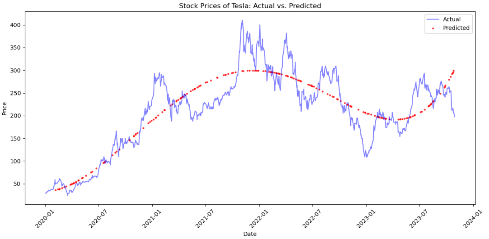

# Fine-Tuning Regression Model
<small style="display: block; margin-top: -10px">Obligatory Assignment for [Introduction to A.I.](https://student.oslomet.no/studier/-/studieinfo/emne/DAVE3625/2023/H%C3%98ST) @ OsloMet</small>

[To notebook](https://nbviewer.org/github/pholdahl/Fine-tuning-regression-model/blob/main/fine-tuning-regression-model.ipynb)

## Tesla Stock Price Predictor With Regression

## Table of Contents
- [About the Project](#about-the-project)
- [Why Use a Regression Algorithm?](#why-use-a-regression-algorithm)
- [How Does It Work?](#how-does-it-work)
- [What Do We Use in This Project and Why?](#what-do-we-use-in-this-project-and-why)
- [Features](#features)
- [Conclusion](#conclusion)
- [Technology Used](#technology-used)
- [Data Source](#data-source)
- [Steps to Run the Project](#steps-to-run-the-project)
- [Contributors](#contributors)
- [License](#license)

### About the Project
This project is a Jupyter Notebook that analyzes how a regression model can be tuned to predict the stock market prices of Tesla (TSLA). 
The objective was to create a prediction algorithm to forecast the closing price of Tesla stock on a specific date. 
This was a group assignment, but the implementation was primarily done by me, with the group choosing my version as the final submission.

### Why Use a Regression Algorithm?
- Regression algorithms are used in machine learning to predict continuous values, such as stock prices.

### How Does It Work?
- Regression is useful for identifying and modeling the relationship between a dependent variable (in this case the stock price) and 
one or more independent variables (historical prices, dates, volume, etc.).
- Unlike classification algorithms, which predict categorical outcomes, regression algorithms are designed to predict quantitative values. 
Since stock prices are continuous and quantitative, regression is the correct type of algorithm to use.
- There are several different types of regression algorithms that can handle different levels of complexity in the data. For example, 
a linear regression algorithm may fit simple linear trends while more complex methods may capture non-linear patterns.

### What Do We Use in This Project and Why?
In our project, we first look at a linear model, which naturally is a bit simple for the data. We then move on to a polynomial model, 
which seems to fit the data much better. In the end, we try to combine the polynomial model with Ridge regression, which in our case turns out to fit our data even better.
- Going from a linear to a polynomial and then adding Ridge regression is an iterative approach in model building.
- We start with the simplest, move on to more complex models, and introduce regularization to get a robust model that can generalize well.
- This methodology fine-tunes the model's complexity against its ability to perform well on unseen data, which is essential in machine learning.

### Features
- **Data Preparation:** Loading and cleaning the Tesla stock price data from a CSV file.
- **Exploratory Data Analysis (EDA):** Visualizing the data trends and identifying patterns.
- **Regression Models:** Implementing and comparing different regression models:
  - Simple Linear Regression
  - Polynomial Regression
  - Ridge Regression combined with Polynomial Features
- **Model Evaluation:** Assessing the models using various metrics such as MAE, MSE, RMSE, R-squared, and MAPE.
- **Prediction Function:** A function to predict the Tesla stock price for a given historical date.

## Conclusion
Through this project, we explored different regression models to predict Tesla stock prices based on historical data. 
We implemented and compared simple linear regression, polynomial regression, and a combination of polynomial regression with Ridge regression. 
While we achieved a certain level of accuracy, when looking at the graph the model does show signs of being overfitted on the training data.

Stock prices are inherently volatile and influenced by a wide range of factors that are not captured in historical price data alone. 
Real-world events, market sentiment, economic indicators, and company-specific news all play critical roles in determining stock prices. 
Thus, relying solely on historical stock price data is insufficient for making reliable future predictions.

To build a more accurate and robust model, it would be necessary to integrate real-time data from trusted news sources, social media sentiment analysis, 
and other relevant statistical information. This would allow for a more comprehensive understanding of the factors influencing stock prices and 
improve the model's predictive power. However, such an approach involves significant complexity and is outside the scope of this assignment.

Overall, this project provided valuable insights into the challenges of stock price prediction and the limitations of using regression models with historical data. 
It also highlighted the importance of considering a broader range of data inputs for more accurate predictions in financial markets.


### Technology Used
- **Python:** The main programming language used for data manipulation and model implementation.
- **Jupyter Notebook:** For interactive development and documentation.
- **Libraries:**
  - `numpy`: For numerical calculations.
  - `pandas`: For data manipulation and analysis.
  - `matplotlib` and `seaborn`: For data visualization.
  - `scikit-learn`: For implementing regression models.

### Data Source
The historical stock price data for Tesla (TSLA) was sourced from Yahoo Finance.

### Steps to Run the Project
1. **Clone the repository:**
  ```sh
    git clone https://github.com/yourusername/Fine-tuning-regression-model.git
  ```
2. **Navigate to the project directory:**
  ```sh
    cd Fine-tuning-regression-model
  ```
3. **Install the required libraries:**
  ```sh
    pip install numpy matplotlib pandas seaborn scikit-learn
  ```
4. **Open the Jupyter Notebook:**
  ```sh
    jupyter notebook
  ```
5. **Run the notebook:**
  - Execute the cells in the notebook to see the data analysis, model implementation, and predictions.

### Contributors
- [LKielland](https://github.com/LKielland)
- [ingridlunde](https://github.com/ingridlunde)
- [pholdahl](https://github.com/pholdahl)

### License
This project is licensed under the MIT License.

